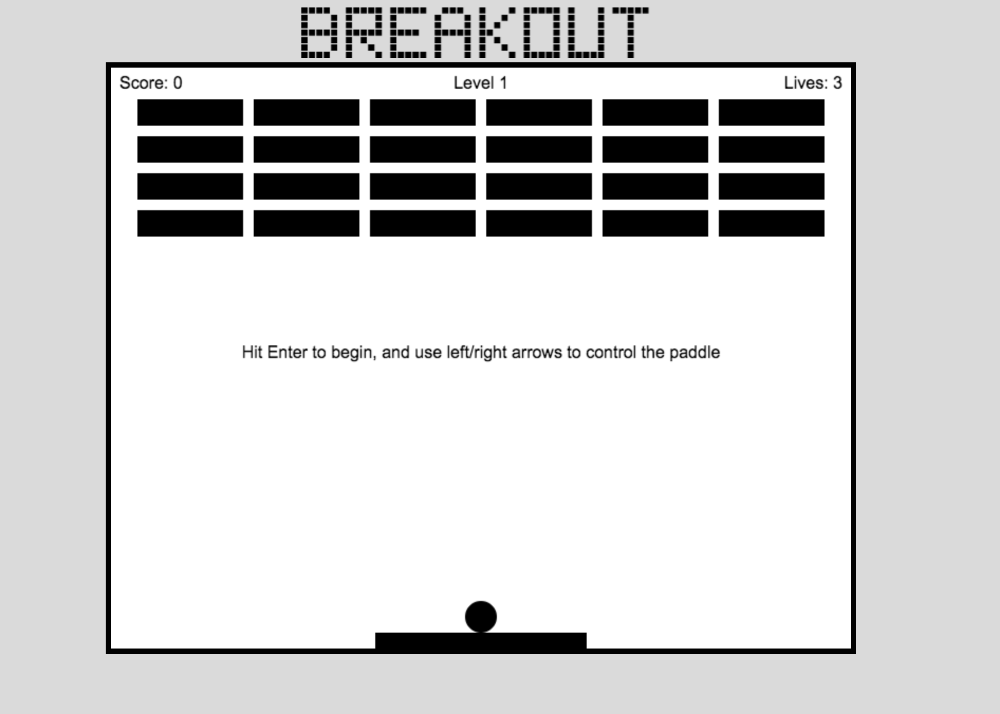

# Breakout
#### Brick breaker game web application built using vanilla javascript and jQuery.  This was a group project at the end of Module 1 at Turing School of Software & Design.

## Project Screen Shots



## To install the dependencies:

```
npm install
```

To fire up a development server:

```
npm start
```

Once the server is running, you can visit:

* `http://localhost:8080/webpack-dev-server/` to run your application.
* `http://localhost:8080/webpack-dev-server/test.html` to run your test suite in the browser.

To build the static files:

```js
npm run build
```


To run tests in Node:

```js
npm test
```
